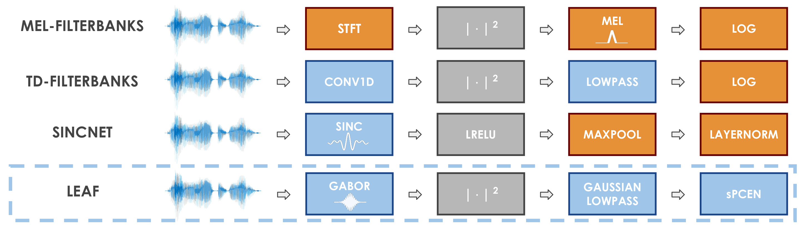

# LEAF: a LEarnable Audio Frontend



LEAF is a learnable alternative to audio features such as mel-filterbanks, that can be initialized as an approximation of mel-filterbanks, and then be trained for the task at hand, while using a very small
number of parameters.

A complete description of the system is available in [our recent ICLR publication](https://openreview.net/forum?id=jM76BCb6F9m).


## Dependencies
* Python 3.8
* [TensorFlow](https://www.tensorflow.org/)
* [TensorFlow Datasets](https://www.tensorflow.org/datasets/overview)
* [Gin](https://github.com/google/gin-config)
* [Lingvo](https://github.com/tensorflow/lingvo)

## Contents
This library contains Tensorflow/Keras code for:

* the LEAF frontend, as well as mel-filterbanks, [SincNet](https://arxiv.org/abs/1808.00158) and [Time-Domain Filterbanks](https://arxiv.org/abs/1711.01161)
* Keras models for [PANN](https://arxiv.org/abs/1912.10211), [PCEN](https://research.google/pubs/pub45911/) and [SpecAugment](https://arxiv.org/abs/1904.08779)
* an example training loop using gin, to train models with various frontends and architectures on tensorflow datasets.

Looking for a PyTorch version? Check this [repo](https://github.com/SarthakYadav/leaf-pytorch) (not managed by google-research).

## Installation
From the root directory of the repo, run:

```bash
pip3 install -e .
```

## Creating a Leaf frontend
We provide learnable and fixed frontends as Keras Models. Instantiating `Leaf` with default arguments will build a LEAF frontend with a 25ms window size, a 10ms window stride, sPCEN as compression function and an initialization of filters on the mel-scale, as described in the paper. For convenience, we also propose Time-Domain Filterbanks, SincNet and SincNet+ as particular instantations of `Leaf`, with different layers and initializers.

```python
import leaf_audio.frontend as frontend

leaf = frontend.Leaf()
melfbanks = frontend.MelFilterbanks()
tfbanks = frontend.TimeDomainFilterbanks()
sincnet = frontend.SincNet()
sincnet_plus = frontend.SincNetPlus()
```

A frontend takes a batch of waveform sequences as inputs, and outputs a batch of time-frequency representations.

```python
import tensorflow as tf
import tensorflow_datasets as tfds

dataset = iter(tfds.load('speech_commands', split='train', shuffle_files=True))
# Audio is in int16, we rescale it to [-1; 1].
audio_sample = next(dataset)['audio'] / tf.int16.max
# The frontend expects inputs of shape [B, T] or [B, T, C].
audio_sample = audio_sample[tf.newaxis, :]

leaf_representation = leaf(audio_sample)
melfbanks_representation = melfbanks(audio_sample)
tfbanks_representation = tfbanks(audio_sample)
sincnet_representation = sincnet(audio_sample)
sincnet_plus_representation = sincnet_plus(audio_sample)
```


## Customizing the frontend architecture

One can easily build new frontends from LEAF, by changing the number
of filters, window_size, compression function, sampling rate and so on.
In this case, one should instantiate `Leaf` with custom arguments.
As an example, the following `custom_leaf` frontend differs from the default LEAF
by using:

* 64 filters instead of 40,
* a window size of 32ms instead of 25,
* an audio sampling rate of 24kHz,
* a learnable pre-emphasis layer,
* log-compression instead of PCEN,
* a non-learnable pooling layer.

As the initialization depends on the sampling rate, we also need to redefine
`complex_conv_init`.

```python
import functools
from leaf_audio import frontend, initializers

n_filters = 64
window_len = 32
sample_rate = 24000
preemp = True
compression_fn = functools.partial(frontend.log_compression, log_offset=1e-5)
complex_conv_init = initializers.GaborInit(sample_rate=sample_rate, min_freq=60., max_freq=7800.)
learn_pooling=False
custom_leaf = frontend.Leaf(learn_pooling=learn_pooling,
                            n_filters=n_filters,
                            window_len=window_len,
                            sample_rate=sample_rate,
                            preemp=preemp,
                            compression_fn=compression_fn,
                            complex_conv_init=complex_conv_init)
```

## Training audio classification models

We also provide a basic training library that allows combining a frontend with
a main classification architecture (including PANN), and training it on a classification dataset.

This library uses Gin: `common.gin` contains the common hyperparameters such as
the batch size or the classification architecture. Each frontend then has its own
`.gin` config file that uses all hyperparameters from `common.gin` and overrides
the frontend class. In `leaf_custom.gin` we show how Gin allows to easily change
hyperparameters of the frontend, as well as the main classification architecture
and using SpecAugment.

To train a model on mel-filterbanks:

```bash
python3 -m example.main --gin_config=example/configs/mel.gin
```

or on LEAF:

```bash
python3 -m example.main --gin_config=example/configs/leaf.gin
```

## Reference
If you use this repository, please consider citing:

```
@article{zeghidour2021leaf,
  title={LEAF: A Learnable Frontend for Audio Classification},
  author={Zeghidour, Neil and Teboul, Olivier and de Chaumont Quitry, F{\'e}lix and Tagliasacchi, Marco},
  journal={ICLR},
  year={2021}
}
```

Note that this is not an officially supported Google product.
